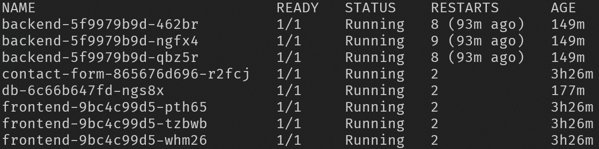

# Deployment of web application stack using Kubernetes

For third homework for DevOps class, I have recreated Docker Compose application stack for Kubernetes. Using [Kompose](https://kompose.io/) tool I converted Docker compose file to Kubernetes definitions ``kompose convert -o k8s/``. Kubernetes yaml files are in k8s folder.

## Web application

App is Vehicle inventory manager. It lets you manage information about SpaceX Starship rockets. For each rocket vehicles, you can view name, type, current location and map of location. You can view vehicles of all types, or just Ship or Booster. Vehicle can be deleted by double clicking on its name or selecting it with the tab and pressing delete key. All vehicles can be deleted at once by clicking Remove all vehicles button. You can message application admin using contact form. 

### API
API is reversed proxied to /api/. It has three GET end points that return all vehicles ``/get-vehicles``, locations ``/get-locations`` and types ``/get-types`` in JSON format. To get a specific vehicle by its id, use ``/get/vehicle/id``. To add a new vehicle use POST endpoint ``/add-vehicle``. For deleting it has two DELETE end points. For deleting all ``/delete-all-vehicles`` and a specific one by its id ``/delete-vehicle/id``

## Application stack

Application stack consist of 4 services. Frontend, backend, MariaDB database and Discord contact form. Frontend is made using Node.js, Vite and React.js. For styling it is using Tailwind CSS. Backend REST API is made using Node.js and Express. [Discord contact form](https://github.com/markokroselj/discord-contact-form) is made using PHP, HTMX and Tailwind.

All images are chosen or build to be lightweight and efficient as possible. For better security images for database, frontend and backend are specified by their exact tag version. Images for Discord contact form, frontend and backend are custom build. Contact form and frontend is using multi-stage build. Backend and frontend for its first step are using Alpine for their base image. To server static files generated by React, frontend image is using very light weight web server [joseluisq/static-web-server](https://hub.docker.com/r/joseluisq/static-web-server/). 

Docker image for frontend is build using GitHub actions when new tag is created. Action builds images with tags using semantic versioning. Image is then pushed to Docker Hub registry. You can also manually trigger the action in GitHub.

External access to the application is handled using NGINX Ingress Controller.

TLS is enabled using cert-manager with a Let’s Encrypt ClusterIssuer

Frontend and backend services have 3 instances.
``kubectl get pods``


Frontend can be deployed using rolling update.

Application stack was deployed on virtual machine server running Ubuntu 24.04.3. It has 4 core 2.8GHz CPU and 16GB of RAM.

# Usage 
1. Point domain to the IP of your machine.
2. Install snapd ``sudo apt install snapd``.
3. Install microk8s 
    ```bash
        sudo snap install microk8s --classic
        mkdir -p ~/.kube
        sudo microk8s config > ~/.kube/config
    ```
4. Install addons
    ```bash
        sudo microk8s enable dns
        sudo microk8s enable dashboard
        sudo microk8s enable storage
        sudo  microk8s enable ingress
        sudo microk8s enable cert-manager
    ```
5. Install kubectl
    ```bash
        sudo curl -L https://storage.googleapis.com/kubernetes-release/release/`curl -s https://storage.googleapis.com/kubernetes-release/release/stable.txt`/bin/linux/amd64/kubectl -o /usr/local/bin/kubectl
        sudo chmod +x /usr/local/bin/kubectl
    ```
6. Clone this repository  ``https://github.com/markokroselj/devops-hw3.git``.
7. cd into it ``cd devops-hw3``.
8. Set discord webhook in ``contact-form-deployment.yaml`` under env
9. Change domain name to yours inside ``ingress.yaml``
10. Change email inside ``issuers.yaml``
11. Create secret for database
    ```bash
        kubectl create secret generic mariadb-pwd \
  --from-literal=mariadb-pwd=yourpassword
  ```
12. Apply Kubernetes files ``sudo microk8s kubectl apply -f k8s/``